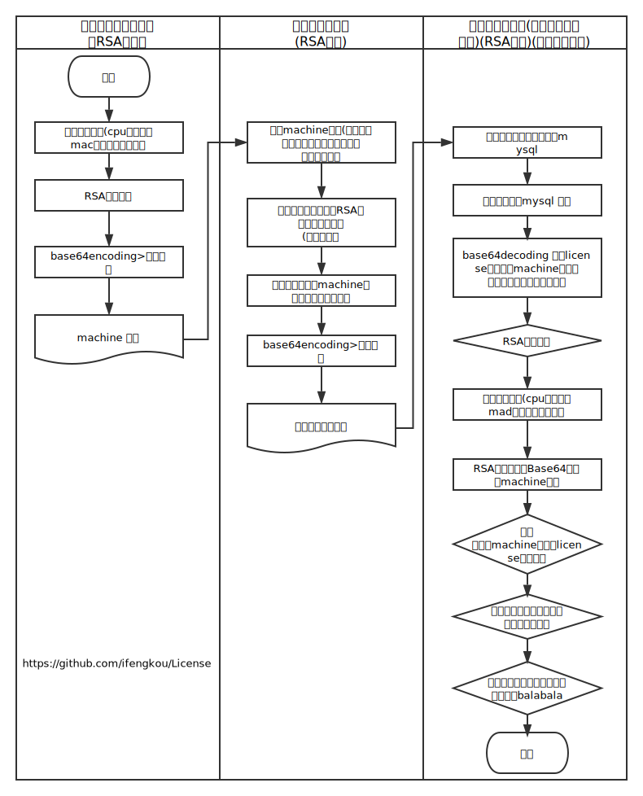

# License

## 介绍

世界上有免费开源项目，也会有商业项目。提倡开源，也倡导保护知识产权

并不是所有产品都是Sass服务，如果是有对外项目输出，且产品采用授权使用形式的企业，那么对自己的软件产品加上授权验证必不可少

该仓库包含两个C# MVVM项目，Master 和 Client ，均提供界面，使用于Windows操作系统；

Client 用于采集客户端机器信息，Master 用于生成授权码/文件，Master 编译后包含License.dll，用于提供给授权产品进行授权验证。具体见下面的[流程图](#流程图)

## 特性：

1. RSA 非对称加密，公钥加密，私钥解密，保证license信息安全
1. Digital Signature公钥数字签名:
	1. 防止license被冒充签发（认证）；
	2. 保证数据完整性；
	3. 数字签名具有不可抵赖性（即不可否认性）
1. 硬件信息采集，防止程序被无限copy
1. 授权截止时间，完成业务上授权需求
1. 使用license的业务代码混淆加密，防止反编译替换跳过验证流程
1. 可以加入自定义数据（授权版本、授权对象、授权功能列表）等等，方便扩展

### 参考  
wikipedia:[公开密钥加密](https://zh.wikipedia.org/wiki/%E5%85%AC%E5%BC%80%E5%AF%86%E9%92%A5%E5%8A%A0%E5%AF%86)  
wikipedia:[数字签名](https://zh.wikipedia.org/zh-cn/%E6%95%B8%E4%BD%8D%E7%B0%BD%E7%AB%A0)

## 流程图



## 安装部署

VS12 直接打开运行或者打包。这里就不提供直接运行的exe了

## 使用

### 采集机器信息

找不到图了,client 生成exe，在客户机器上执行，当前目录会生成机器信息文件

### 制作授权


包含证书验证和证书生成两个部分，举例证书验证：

我们通过Master程序对生成的license.lic 文件进行解密验证：

``` xml
<?xml version="1.0" encoding="utf-16"?>
<License xmlns:xsi="http://www.w3.org/2001/XMLSchema-instance" xmlns:xsd="http://www.w3.org/2001/XMLSchema">
	<LicenceTo>ifengkou</LicenceTo>
	<ProductName>cms</ProductName>
	<MajorVersion>1</MajorVersion>
	<MinorVersion>0</MinorVersion>
	<Edition>标准版</Edition>
	<SerialNumber>A7BFB2EF-7C59-44FB-9A58-6A0252975C54</SerialNumber>
	<ExpireTo>2015-12-31T00:00:00</ExpireTo>
	<UserData>01,0101,0102,0103,22,2211,1133,2231,2202,2205,2207,2209,2206,2230</UserData>
	<Signature>Y3ayAMC7XZAT30eDlHqGybWvTjodlEJqZ+d09ytgNl3PEEd/9MM0OZfg5KIJfyFY1DTA5r99oVsT4Q0umpAfO5Gw4XPymQhxShtiWRLlBB7GME2Z6rxQZoGdJkPWTamG6l2pFUqcS7PAC3Iqee7Lnc6G35ML8s9Uxa++Vt3D7Aw=</Signature>
</License>
```
	
### 如何在程序上使用授权验证

1. 项目引用License.Client.dll文件
2. 将生产的license.lic 文件拷贝至运行项目根目录下
3. 在项目关键Controller上加上授权文件相关代码

```csharp
    //获取lic文件，默认获取根目录下的license.lic文件
    License license = License.GetLicense()
    //获取主版本，副版本，产品类型，序列号，过期日期，用户信息（如权限集合），签名 等信息
    license.Copyright
    license.LicenceTo
    license.ProductName
    license.MajorVersion
    license.MinorVersion
    license.MachineHash
    license.ExpireTo
    license.license.UserData
    license.DaysLeftInTrial
    license.SerialNumber
```

 4.验证、使用
 
```csharp
	//验证日期、验证MachineHash
 	bool License.VerifyLicense(License lic);

 	//也可以自己利用参数值做判断
	if(license.ExpireTo > Date.now()){
		//过期
	}

	if(license.DaysLeftInTrial < 30){
		//即将过期，小于30天。可以提示用户
	}

	//利用UserData，将系统的菜单权限带过来
	//license.UserData = 01,0101,0102......
	String[] menus = license.UserData.split(",");
```

## 贡献

有任何意见或建议都欢迎提 issue，或者直接提给 [@ifengkou](mail://ifengkou@hotmail.com)
