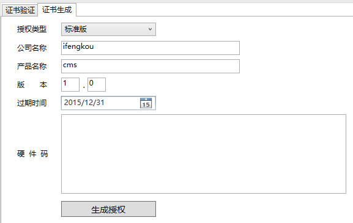

# License
C#程序，Web程序 许可文件制作工具

##介绍##

世界上有免费开源项目，也会有商业项目。提倡开源，也倡导保护知识产权

该Repository包含两个项目：分为Master  和 Client 项目。

Client用于收集服务器电脑相关配置信息（如CPU,磁盘，网卡等等），形成硬件码信息文件。

Master 用于生成授权文件，根据Client生成的硬件码 生成 授权文件.lic

程序生成授权文件 截图：

通过引用License.dll，我们可以利用下列信息进行授权验证：

	主版本，副版本，产品类型，序列号，过期日期，用户信息（如权限集合），签名

我们通过Master程序对.lic 文件进行解密验证：

	<?xml version="1.0" encoding="utf-16"?>
	<License xmlns:xsi="http://www.w3.org/2001/XMLSchema-instance" xmlns:xsd="http://www.w3.org/2001/XMLSchema">
	  <LicenceTo>ifengkou</LicenceTo>
	  <ProductName>cms</ProductName>
	  <MajorVersion>1</MajorVersion>
	  <MinorVersion>0</MinorVersion>
	  <Edition>标准版</Edition>
	  <SerialNumber>A7BFB2EF-7C59-44FB-9A58-6A0252975C54</SerialNumber>
	  <ExpireTo>2015-12-31T00:00:00</ExpireTo>
	  <UserData>01,0101,0102,0103,22,2211,1133,2231,2202,2205,2207,2209,2206,2230</UserData>
	  <Signature>Y3ayAMC7XZAT30eDlHqGybWvTjodlEJqZ+d09ytgNl3PEEd/9MM0OZfg5KIJfyFY1DTA5r99oVsT4Q0umpAfO5Gw4XPymQhxShtiWRLlBB7GME2Z6rxQZoGdJkPWTamG6l2pFUqcS7PAC3Iqee7Lnc6G35ML8s9Uxa++Vt3D7Aw=</Signature>
	</License>

##安装部署##

VS12 直接打开运行或者打包。这里就不提供直接运行的exe了

##使用##

 1.项目引用License.Client.dll文件

 2.将生产的license.lic 文件拷贝至运行项目根目录下

 3.在项目关键Controller上加上授权文件相关代码

    //获取lic文件，默认获取根目录下的license.lic文件
    License license = License.GetLicense()
    //获取主版本，副版本，产品类型，序列号，过期日期，用户信息（如权限集合），签名 等信息
    license.Copyright
    license.LicenceTo
    license.ProductName
    license.MajorVersion
    license.MinorVersion
    license.MachineHash
    license.ExpireTo
    license.license.UserData
    license.DaysLeftInTrial
    license.SerialNumber

 4.验证、使用

 	//验证日期、验证MachineHash
 	bool License.VerifyLicense(License lic);

 	//也可以自己利用参数值做判断
	if(license.ExpireTo > Date.now()){
		//过期
	}

	if(license.DaysLeftInTrial < 30){
		//即将过期，小于30天。可以提示用户
	}

	//利用UserData，将系统的菜单权限带过来
	//license.UserData = 01,0101,0102......
	String[] menus = license.UserData.split(",");
	

##贡献##

有任何意见或建议都欢迎提 issue，或者直接提给 [@ifengkou](mail://ifengkou@hotmail.com)

##License##
MIT